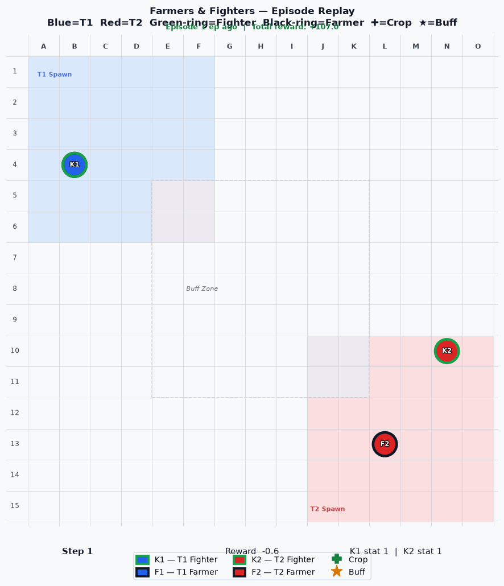

# rts_dqn_agents
For CSCI486 Deep and Reinforcement Learning final project.

## The Game: Farmers and Fighters
### How To Win
- The game is made up of 2 teams. Each team initializes (spawns) in opposite corners of the map stochastically.
- Scattered randomly around the map will be crops that will spawn on a 5-step timescale. With a limit of 3 present crops in each of the North and South halves of the environment.
- Each team will have 2 agents: a farmer and a fighter.
    - The farmer searches and harvests crops; the farmer cannot attack the other team’s fighter or farmer.
    - The fighter on each team is initialized with a base stat of 1 that is increased by +1 for each crop the farmer harvests. 
    - If the fighter locates and collects the buff near the center of the environment, their stats increase by +5 for 5 steps.
- The fighter with the highest stat will eliminate the other.
    - The farmer can be eliminated first.
- First team to eliminate the other teams, farmer and fighter win.

-

## Table of Contents
- [Features](#-features)
- [Prerequisites](#-prerequisites)
- [Installation](#%EF%B8%8F-installation)
- [Usage](#-usage)
- [Configuration](#%EF%B8%8F-configuration)
- [Contributing](#-contributing)
- [License](#-license)

## Features
- Multi-layer Perceptron Q-network
- Experience Replay Buffer
- Manual tuned hyperparameters
- Reward fucntion
- Logging

## Prerequisites
Before running training, ensure you have the following tools set up on your machine:
- [WSL 2](https://learn.microsoft.com/en-us/windows/wsl/install) (For Windows users)
- [Python3.14](https://www.python.org/downloads/) (3.12+)
- [Git](https://git-scm.com)

## Installation

Follow these quick steps to get your local development environment running:

1. Clone the repository down to your local machine:
   ```bash
   git clone https://github.com/Brady-Source/rts_dqn_agents/
   ```

2. Navigate directly into the project directory:
   ```bash
   cd rts_dqn_agents
   ```

3. Initialize a virtual environment:
   ```bash
   python3 -m venv venv
   ```
    If venv is not installed: sudo apt install python3-venv

4. Activate your new VE:
   ```bash
   source venv/bin/activate
   ```

5. Install all the required dependencies:
   ```bash
   pip install -r requirements.txt
   ```

## Usage

### Starting the Application
To launch the project and start training the model, run:
```bash
cd src
python3 main.py
```

## Configuration

You can easily configure the hyperparameters in train_dqn.py 

1. Open train_dqn.py, scroll just below the imports:
   ```adjust these parameters in the training file to change how the bots learn.
   NUM_EPISODES = 200       (Total training cycles or games to play)
   GAMMA = 0.99             (Discount factor prioritizing future versus immediate rewards)
   LR = 3e-4                (Learning rate controlling optimization step sizes)
   BATCH_SIZE = 64          (Number of training samples used per update)
   EPS_START = 1.0          (Initial probability of taking random actions)
   EPS_END = 0.1            (Minimum final probability of taking random actions)
   EPS_DECAY = 5_000        (Steps over which random action probability decreases)
   TARGET_UPDATE_FREQ = 100 (Frequency of updating the secondary target network)
   ```

## License

This software project is licensed under the terms of the MIT License. Please see the [LICENSE](LICENSE) file for complete details and restrictions.

